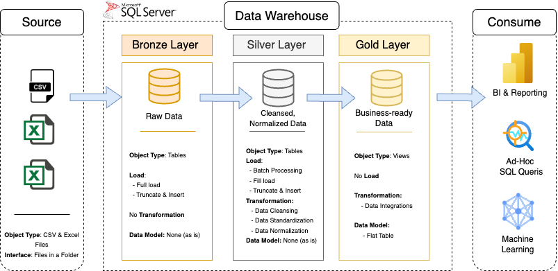

# Emission Data Integration Project

This project focuses on creating a unified data pipeline for managing emission factor records. The goal is to ingest three provided data files (each with slightly different formats), transform and merge them into a single source of truth (a database), and export the unified data into a flat CSV file.

## 📖 Project overview

This project consits of the following tasks: 

1. Designing a database schema to store emission factor records uniformly.
2. Writing the ETL pipeline to initialize the database, load the data, and handle transformations.
3. Exporting approved data into a normalized CSV file.

## 🏗️ Data Architecture

The data architecture for this project follows Medallion Architecture Bronze, Silver, and Gold layers:

- **Bronze Layer**: Stores raw data as-is from the source systems. Data is ingested from CSV & Excel Files into SQL Server Database.
- **Silver Layer**: This layer includes data cleansing, standardization, and normalization processes.
- **Gold Layer**: business-ready data modeled into a flat table to be used in AI algoriths.

